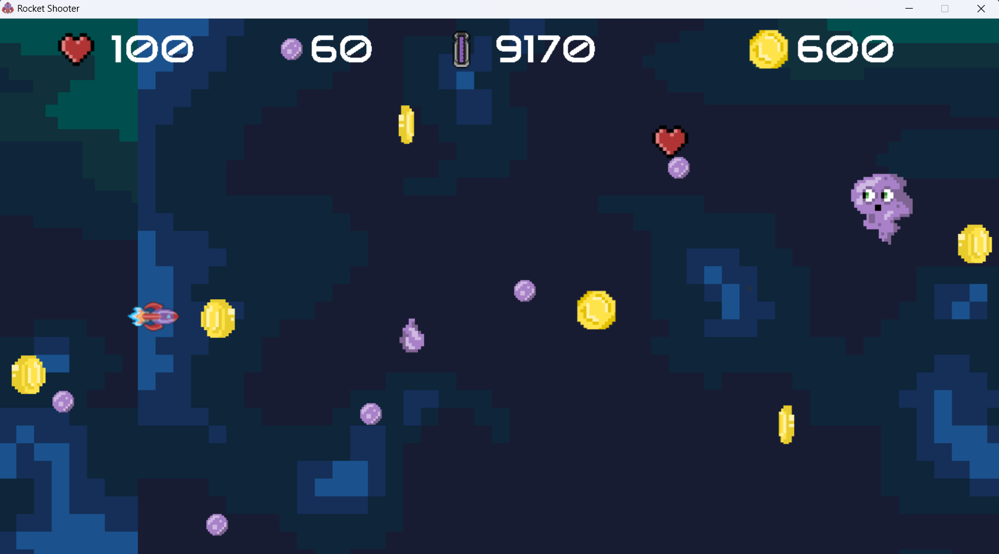

## Download
Dowload Here: https://tdavies.itch.io/escape-from-planet-drip

## Screenshot

## Code Description
I used the Pygame library in Python to make the game. There are different classes, which inherit from the pygame sprite class. These sprite objects are added to groups to help classify their collisions. The Drip Guy enemy is derived from an Enemy super class. This isn't fully fleshed out as the purpose of the super class would be to mass produce more enemies efficiently. 

## How to play
Use up arrow to go up, and use space bar to shoot. The point of the game is to be able to get the most amount of coins. Meanwhile, you must also dodge all the incoming bullets, and collect different resources such as ammo, health and fuel to keep your journey going.

## Build instructions
If you don't want to download using the link above then download the zip folder on git, and using your local python interpreter run the code.
